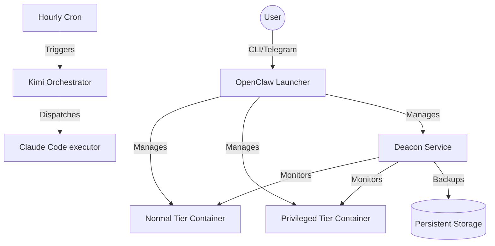

# Architecture Overview

OpenClaw Launcher implements a robust, tiered architecture designed to provide flexible resource management and feature availability for different user needs.

## Tier System

The system is divided into two primary tiers: **Normal** and **Privileged**. Each tier is containerized and comes with different resource limits and pre-installed capabilities.

### Resource Comparison

| Resource | Normal Users | Privileged Users |
|----------|-------------|------------------|
| **Base Image** | Python 3.11 | Python 3.13 |
| **CPU Limit** | 4 cores | 8 cores |
| **Memory Limit** | 16GB | 128GB |
| **Memory Reservation** | 4GB | None |
| **Disk Space** | 50GB | 100GB |

### Feature Comparison

| Feature | Normal Tier | Privileged Tier |
|---------|-------------|-----------------|
| **Pre-installed Skills** | Basic 20 skills | Full ClawHub library |
| **Speech-to-Text** | Deepgram (English only) | Whisper API + Local (Multilingual) |
| **Model Access** | Kimi, Toad, Codex | All + Claude + Gemini |

## Core Components

### 1. OpenClaw Containers

These are the main execution environments for your AI agents. They are based on the official OpenClaw images but are enhanced with pre-installed plugins and the Telegram STT workaround.

### 2. Deacon Service

The Deacon is a management daemon that runs alongside your OpenClaw instances. It handles:
- **Automated Plugin Updates**: Keeps your skills and providers up-to-date.
- **Health Monitoring**: Ensures containers are responsive and working correctly.
- **Backup Management**: Regularly backs up your custom skills and configuration.

### 3. Orchestrator

The orchestrator is an hourly cron job driven by a Kimi K2.5 agent. It manages complex tasks like PR reviews, update checks, and session maintenance across your OpenClaw deployment.

## Deployment Layout

## Security

- **Docker Secrets**: All sensitive API keys and tokens are managed via Docker secrets, ensuring they are never exposed in environment variables or logs.
- **Resource Isolation**: Each tier is isolated in its own container with strictly enforced resource limits.
